# creature

C'est un projet ambitieux et passionnant — quelque part entre un moteur de jeu custom et un simulateur de vie artificielle. Voici une feuille de route ordonnée avec des conseils d'implémentation concrets.

---

## Choix du langage

**Rust** est le meilleur choix pour ce projet, et voici pourquoi : tu vas écrire un moteur physique, du ray casting, des simulations de fluides, et de l'IA temps réel. Les performances sont non-négociables. Rust te donne la vitesse du C sans les bugs de mémoire qui rendraient un tel projet cauchemardesque à déboguer. Python est beaucoup trop lent (même avec NumPy), Java acceptable mais verbeux, C faisable mais dangereux à cette échelle.

**Architecture recommandée** : Rust pour tout le cœur (physique, IA, rendu), avec `macroquad` ou `winit`+`wgpu` comme couche de fenêtrage/rendu 2D. Pas besoin d'Unity — un moteur custom en Rust est tout à fait réaliste sur plusieurs mois.

---

## Feuille de route ordonnée

Voici les grandes phases dans l'ordre où je recommande de les aborder :---

### Phase 1 — Fenêtre, rendu et éditeur d'environnement

**Objectif** : avoir quelque chose à l'écran sur lequel travailler.

- Choisis `macroquad` (très simple à démarrer) ou `winit`+`wgpu` (plus bas niveau, meilleur long terme). Je recommande `macroquad` pour commencer, puis migrer si nécessaire.
- Implémente une **boucle de jeu fixe** : `update(dt)` séparée du `render()`. Le delta-time fixe (ex. 60 Hz) est essentiel pour que la physique soit déterministe.
- L'environnement est une **tilemap** : une grille 2D de cellules, chaque cellule ayant un type de matériau (vide, pierre, échelle, eau, etc.). C'est simple, rapide à rendre, et suffisant pour commencer.
- L'éditeur : clique gauche pour poser une tuile, clique droit pour effacer, une palette de matériaux sur le côté. Tu peux sérialiser la carte en JSON dès le début.

**Problème fréquent** : ne pas séparer la logique de simulation du rendu dès le début. Fais-le absolument — ça te sauvera des semaines plus tard.

---

### Phase 2 — Moteur physique

C'est le cœur de tout. Voici les algorithmes à implémenter dans l'ordre :

- **AABB (Axis-Aligned Bounding Box)** : collision rectangle contre rectangle, la base. Suffisant pour les tuiles.
- **Résolution d'impulsions** : quand deux objets se chevauchent, calcule une impulsion pour les séparer en tenant compte de leur masse et vélocité. C'est l'algorithme standard des moteurs 2D.
- **Corps rigide** : chaque entité a une position, vélocité, accélération, masse, et moment d'inertie. Intégration par Euler semi-implicite (plus stable qu'Euler classique).
- **Polygones** : le corps de l'organisme n'est pas un rectangle. Utilise la **séparation d'axes (SAT)** pour les collisions entre polygones convexes. Pour les formes concaves, décompose-les en polygones convexes.
- **Joints et contraintes** : les membres de l'organisme sont des segments reliés par des contraintes (distance fixe ou angle limité). Utilise la méthode **Verlet** avec correction de position itérative (Position-Based Dynamics, PBD) — c'est plus stable que les forces pures pour les chaînes articulées.

**Conseil important** : n'essaie pas de simuler l'eau avec un vrai solveur de fluides (SPH, Lattice Boltzmann) tout de suite. Commence par un système de particules simplifié qui "ressemble" à de l'eau — Rain World lui-même utilise des approximations visuelles.

---

### Phase 3 — Corps de l'organisme et animation procédurale

La représentation en chaîne de points est exactement ce que Rain World utilise. Voici comment la modéliser :

- La **colonne vertébrale** est une suite de points `p0, p1, ..., pN`, chaque point ayant un rayon `r_i` (largeur du corps à cet endroit). Le rendu trace une B-spline ou un ensemble de cercles entre les points.
- Les **membres** (bras, pattes, queue, tête) sont attachés à certains points de la colonne. Chaque membre est lui-même une petite chaîne de 2-3 segments.
- **Animation procédurale via IK (Inverse Kinematics)** : étant donné une position cible pour le bout d'un membre (ex. "la patte doit toucher ce point du sol"), calcule les angles de chaque segment. L'algorithme **FABRIK** (Forward And Backward Reaching IK) est simple à implémenter et très stable — c'est le standard pour ce type d'animation.
- **Détection d'appui** : pour marcher, chaque patte cherche le point de contact le plus proche dans un cône en dessous d'elle, puis FABRIK positionne la patte vers ce point. La synchronisation des pattes (alternance gauche/droite) est gérée par un simple automate d'état.

**Pour grimper** : même principe, mais le cône de recherche est orienté vers la surface sur laquelle l'organisme se déplace.

---

### Phase 4 — Organes sensoriels

- **Vue (ray casting)** : depuis la position de l'œil, projette N rayons dans un cône (angle d'acquisition). Pour chaque rayon, avance pas à pas et teste la collision avec les tuiles et entités. La précision dépend de la largeur angulaire entre les rayons — plus de rayons = plus précis mais plus lent. Pour la spécificité de l'œil (voir loin mais une seule couleur vs voir tout mais de près), pondère la portée selon la largeur spectrale détectée.
- **Odeurs (particules)** : chaque source émet des particules de "nuage d'odeur" à chaque frame. Ces particules ont une vélocité (légèrement aléatoire + courant d'air), une durée de vie, et sont bloquées par les tuiles opaques. La représentation en 3 valeurs RGB pour les odeurs est très élégante — ça permettra de les visualiser facilement dans l'éditeur.
- **Son (ondes)** : une onde sonore est un cercle qui s'étend depuis la source. Les surfaces la réfléchissent (simplifié). Pour l'organisme, l'information reçue est la direction + intensité de chaque source sonore qui l'atteint. Tu peux commencer par une version simplifiée sans réflexion.
- **Toucher** : c'est simplement la liste des matériaux en contact direct lors de la résolution des collisions — tu l'as déjà gratuitement avec la phase 2.

---

### Phase 5 — Représentation interne du monde et pathfinding

L'organisme ne "voit" pas la carte complète — il construit une représentation partielle de son environnement à partir de ses sens. C'est crucial pour l'IA.

- **Carte mémorielle** : une grille (plus basse résolution que la tilemap) que l'organisme met à jour quand ses rayons visuels touchent des tuiles. Les zones non vues restent inconnues.
- **Pathfinding** : utilise **A\*** sur un graphe de navigation, pas sur la tilemap brute. Construis un **graphe de plateformes** : les nœuds sont les plateformes accessibles, les arêtes sont les transitions possibles (marcher, sauter, grimper). A\* trouve le chemin optimal. Pour les organismes capables de voler ou nager, le graphe est différent.
- **Prédiction des objets dynamiques** : pour éviter des projectiles ou suivre une proie, extrapole la position future d'un objet en prolongeant sa trajectoire actuelle. Simple et efficace.

---

### Phase 6 — IA de l'organisme

C'est la partie la plus ouverte. Voici une architecture en couches :

La couche haute (comportement) prend des **décisions** : chasser, fuir, explorer, se reposer. Ce peut être un **Behavior Tree** (arbre de comportement) — une structure hiérarchique de nœuds `Selector`, `Sequence`, `Condition`, `Action`. C'est lisible, débuggable, et extensible. Commence par ça avant d'introduire l'apprentissage.

La couche intermédiaire (navigation) reçoit un objectif de la couche haute et utilise A\* pour planifier le chemin.

La couche basse (contrôle moteur) traduit le chemin en forces appliquées aux membres. C'est là qu'intervient l'animation procédurale.

**Pour l'apprentissage** (quand tu seras prêt) : la méthode la plus adaptée à ce type de projet est le **reinforcement learning** avec un réseau de neurones. L'approche standard est **PPO (Proximal Policy Optimization)**. Le réseau prend en entrée les perceptions sensorielles (vecteur de valeurs : rayons visuels, odeurs détectées, touchers actifs) et produit en sortie un vecteur d'actions (forces sur chaque membre, direction d'orientation). La récompense peut être simple : +1 pour manger, -1 pour mourir.

**Problème connu** : l'entraînement par RL nécessite des milliers de simulations. Tu devras faire tourner la simulation bien plus vite que le temps réel (mode "headless") pour que l'apprentissage soit praticable.

---

### Phase 7 — Extensions

- **Fluides** : la solution la plus simple visuellement est une simulation de **particules avec tension de surface** (algorithme SPH simplifié, ou même juste des particules qui se repoussent légèrement). Pour des cascades visuellement convaincantes comme dans Rain World, de simples particules avec vélocité et une légère cohésion suffisent.
- **Projectiles** : traite-les comme des corps rigides légers avec collision continue (swept AABB) pour éviter qu'ils traversent des murs fins.
- **Éditeur d'organismes** : interface pour placer des organes sur le corps, ajuster leur orientation et paramètres, puis sauvegarder/charger en JSON.

---

### Ordre de priorité absolu

Ne sois pas tenté de tout coder en parallèle. Le seul ordre qui fonctionne : **physique avant corps, corps avant sens, sens avant IA**. Chaque couche repose sur la précédente. Si la physique n'est pas solide, l'IK vacille, les rayons sont faux, et l'IA apprend sur des données incorrectes.

Un dernier conseil : Rain World a été développé sur 7 ans. Ton objectif est d'en avoir une version fonctionnelle et fascinante, pas identique. Commence petit — un organisme avec deux pattes qui marche sur une plateforme est déjà un résultat remarquable.